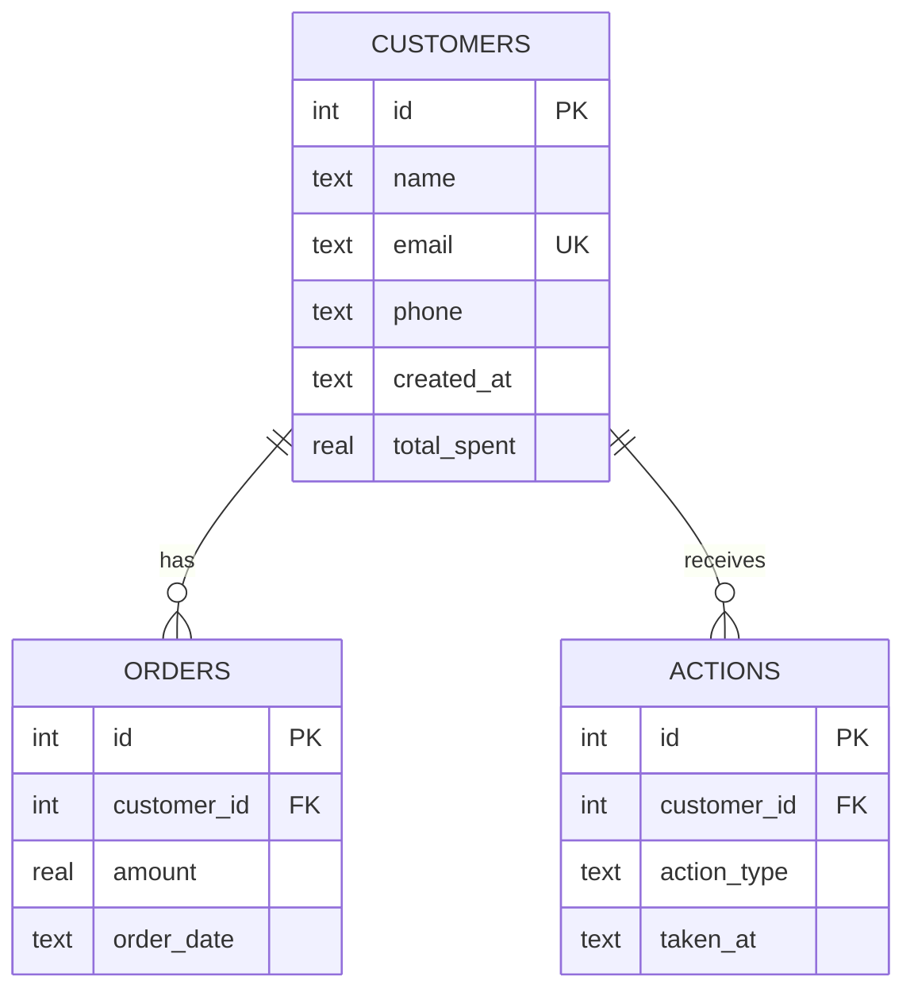

# 📊 Customer Churn Prediction Dashboard

A full-stack **Customer Retention System** that detects at-risk customers, recommends targeted actions, and tracks recovery — all through a sleek, real-time dashboard.

Built with **FastAPI**, **SQLite**, and a **vanilla JS/CSS** frontend.


---

## ✨ Features

| Feature | Description |
|---|---|
| **Risk Scoring** | Automatic churn risk classification (High / Medium / Low / Safe) based on inactivity and order history |
| **Customer Segmentation** | RFM-style segments — *High Spender*, *Loyal*, *Regular*, *One-time* |
| **Action Engine** | Context-aware suggested actions (e.g. "Send win-back discount 20%" for high-risk one-time buyers) |
| **Bulk Actions** | Select multiple customers and send offers in one click |
| **Advanced Filtering** | Filter by risk level, segment, inactivity range; sort by days inactive or total spent |
| **CSV Export** | Export filtered views, high-risk only, or all customers as CSV |
| **CSV Import** | Upload a CSV to bulk-import new customers (deduplicates by email) |
| **Action Log** | Slide-out panel showing the 50 most recent retention actions |
| **Recovery Tracking** | Automatically flags customers who placed an order after being contacted |
| **Dark UI** | Modern dark-themed dashboard with color-coded risk badges and segment pills |

---

## 🏗️ Architecture

```
chrun-predictor/
├── main.py                  # FastAPI application & API routes
├── requirements.txt         # Python dependencies
├── churn.db                 # SQLite database (auto-created)
├── backend/
│   ├── database.py          # DB connection & schema (customers, orders, actions)
│   ├── rules.py             # Risk, segmentation & action recommendation engine
│   └── seed.py              # Generates 50 realistic demo customers
└── frontend/
    ├── index.html           # Dashboard markup
    ├── style.css            # Dark-themed CSS with design tokens
    └── app.js               # Client-side state, rendering & API calls
```

### Data Model



### Risk & Segmentation Rules

**Risk Level** (based on `days_inactive` and `order_count`):

| Condition | Risk |
|---|---|
| 1 order & > 60 days inactive | 🔴 High |
| > 90 days inactive | 🔴 High |
| > 60 days inactive | 🟡 Medium |
| > 30 days inactive | 🟢 Low |
| ≤ 30 days inactive | ⚪ Safe |

**Segment** (based on `order_count` and `total_spent`):

| Condition | Segment |
|---|---|
| total_spent > $10,000 | 💎 High Spender |
| order_count ≥ 5 | 💜 Loyal |
| order_count 2–4 | 🔵 Regular |
| order_count = 1 | ⚫ One-time |

---

## 🚀 Getting Started

### Prerequisites

- **Python 3.9+**

### Installation

```bash
# 1. Clone the repository
git clone https://github.com/your-username/chrun-predictor.git
cd chrun-predictor

# 2. Create & activate a virtual environment
python -m venv venv

# Windows
venv\Scripts\activate

# macOS / Linux
source venv/bin/activate

# 3. Install dependencies
pip install -r requirements.txt
```

### Seed the Database

Populate the database with 50 demo customers across 5 behavioral patterns (one-time, big spender, old churned, regular, loyal):

```bash
python -m backend.seed
```

### Run the Server

```bash
uvicorn main:app --reload
```

Open **http://127.0.0.1:8000** in your browser.

---

## 📡 API Reference

### Customers

| Method | Endpoint | Description |
|---|---|---|
| `GET` | `/customers` | List customers with optional filters |
| `GET` | `/customers/{id}` | Get single customer with order history |

**Query Parameters** for `GET /customers`:

| Param | Type | Default | Description |
|---|---|---|---|
| `risk` | string | `all` | Comma-separated risk levels (e.g. `High,Medium`) |
| `segment` | string | `all` | Segment filter (`High Spender`, `Loyal`, `Regular`, `One-time`) |
| `min_days` | int | — | Minimum days inactive |
| `max_days` | int | — | Maximum days inactive |
| `sort_by` | string | `days_inactive` | Sort field (`days_inactive` or `total_spent`) |
| `order` | string | `desc` | Sort order (`asc` or `desc`) |

### Actions

| Method | Endpoint | Description |
|---|---|---|
| `POST` | `/actions` | Record retention actions for customers |
| `GET` | `/actions/log` | Get the 50 most recent actions |

**POST `/actions`** body:

```json
{
  "customer_ids": [1, 2, 3],
  "action_type": "retention_email"
}
```

### Export / Import

| Method | Endpoint | Description |
|---|---|---|
| `GET` | `/export/csv` | Download filtered customers as CSV (same query params as `/customers`) |
| `POST` | `/upload/csv` | Upload a CSV file to import customers (`multipart/form-data`) |

**CSV Import format** (required columns: `name`, `email`; optional: `phone`, `total_spent`, `last_purchase_date`):

```csv
name,email,phone,total_spent,last_purchase_date
Jane Doe,jane@example.com,+1-555-123-4567,250.00,2025-01-15
```

---

## 🖥️ Dashboard Overview

The dashboard provides a complete **detect → decide → act → measure** workflow:

1. **Metric Cards** — At-a-glance totals for customers, high-risk count, contacted this week, and recovered customers
2. **Filter Bar** — Multi-select risk checkboxes, segment dropdown, inactivity range inputs, and sort controls
3. **Customer Table** — Color-coded risk badges and segment pills, with per-row "Take Action" buttons
4. **Bulk Action Bar** — Appears when customers are selected via checkboxes; send offers to all at once
5. **Action Log Panel** — Slide-out panel showing recent retention actions with timestamps
6. **Export Dropdown** — Quick exports for current view, high-risk only, high + medium risk, or all customers
7. **CSV Upload** — Import customers from a CSV file directly via the toolbar

---

## 🛠️ Tech Stack

| Layer | Technology |
|---|---|
| **Backend** | [FastAPI](https://fastapi.tiangolo.com/) (Python) |
| **Database** | SQLite via `sqlite3` (zero config, file-based) |
| **Server** | [Uvicorn](https://www.uvicorn.org/) ASGI server |
| **Frontend** | Vanilla HTML / CSS / JavaScript (no framework) |
| **Styling** | CSS custom properties, dark theme, responsive grid |

---

## 📂 CSV Format for Import

| Column | Required | Description |
|---|---|---|
| `name` | ✅ | Customer full name |
| `email` | ✅ | Unique email (duplicates are skipped) |
| `phone` | ❌ | Phone number |
| `total_spent` | ❌ | Lifetime spend (defaults to `0.0`) |
| `last_purchase_date` | ❌ | ISO date string (defaults to current time) |

---

## 🤝 Contributing

1. Fork the repository
2. Create a feature branch (`git checkout -b feature/amazing-feature`)
3. Commit your changes (`git commit -m 'Add amazing feature'`)
4. Push to the branch (`git push origin feature/amazing-feature`)
5. Open a Pull Request

---

## 📄 License

This project is licensed under the MIT License. See [LICENSE](LICENSE) for details.
